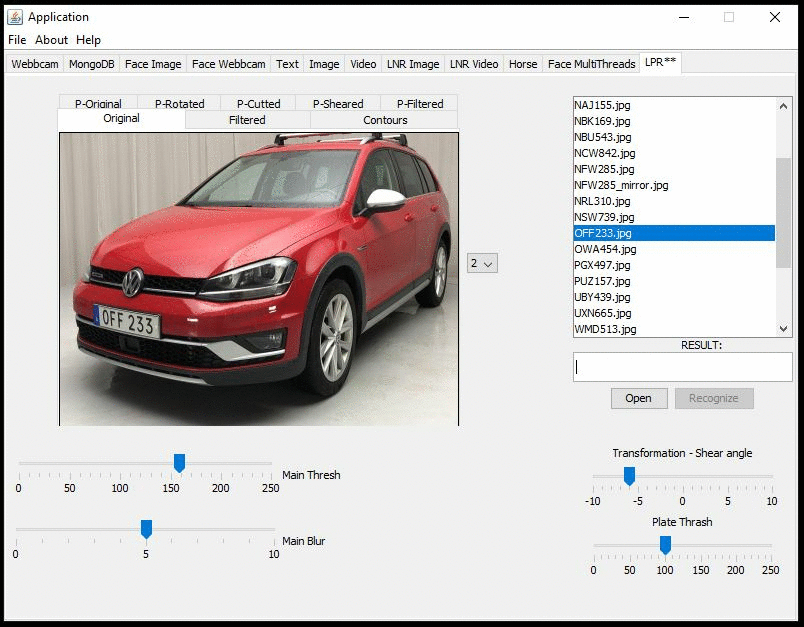
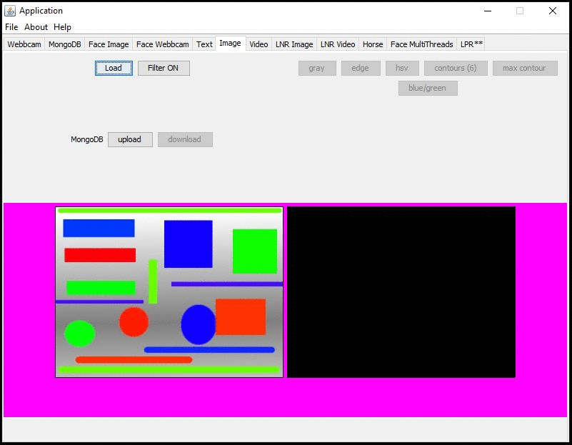
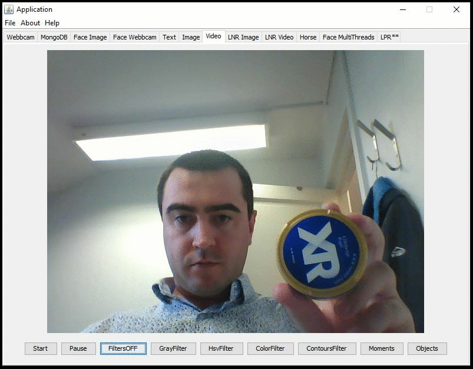
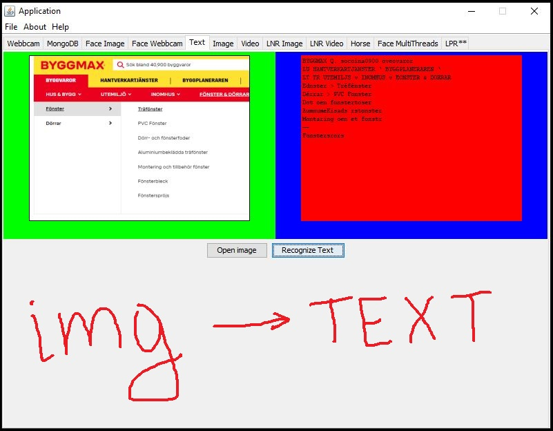

# Java development with focus on computer vision

* OpenCv, Java
* Optical Character Recognition
* Machine Vision 
* Artificial Intelligence
* Neural Networks
* ANPR
* Tesseract and Tess4J
* MongoDB 
* Swing
* Python

# License Plate Recognition	

# Image filtering and transformation 

# Face Detection, Eyes, Smile

# Video Tracking

# Text Recognition

