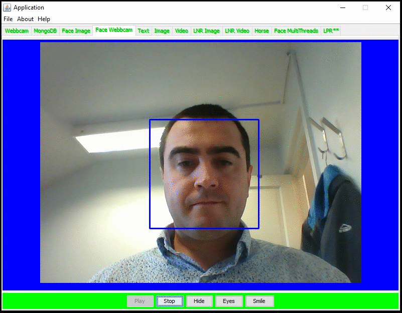

# Java development with focus on computer vision

* OpenCv
* Optical Character Recognition
* Machine Vision 
* Artificial Intelligence
* Neural Networks
* ANPR
* Tesseract and Tess4J
* MongoDB 
* Java 
* Swing
* Python

* Text Recognition

* License Plate Recognition	

# Image filtering and transformation 

* Face Detection, Eyes, Smile

